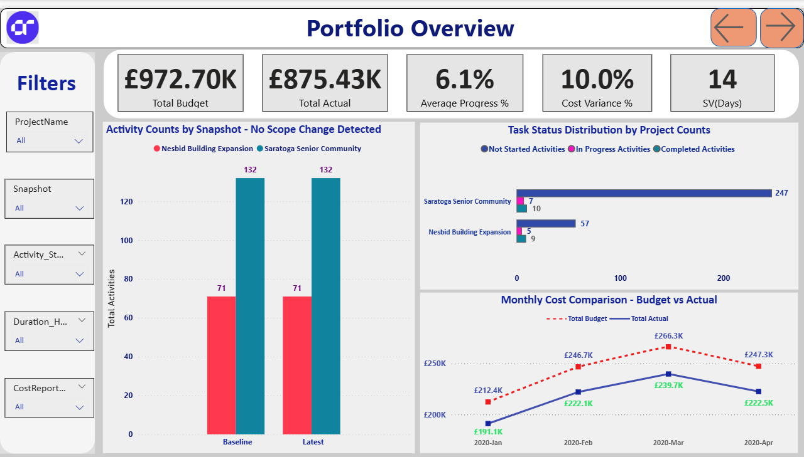
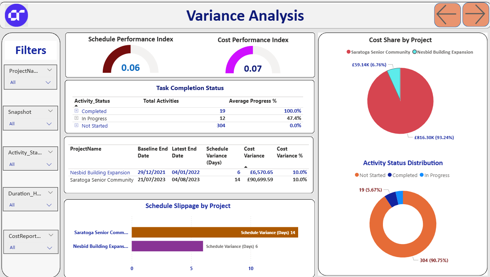

# 📊 Project Portfolio Performance & Earned Value Analysis Dashboard

## 🎯 Project Objective
This project presents a comprehensive **Project Portfolio Performance Dashboard** built using Earned Value Management (EVM) principles to assess schedule health, cost efficiency, and delivery risk across a multi-project construction portfolio.

The primary objective was to move beyond basic budget tracking and provide a clear, evidence-based view of how **actual spend, planned progress, and earned value** align in practice. The dashboard is designed to support early identification of execution issues, highlight risk concentration, and enable informed intervention before delays and cost overruns escalate.

## 🌐 Live Dashboard Access
Link - https://github.com/ShivamRajput22/Project-Portfolio-Performance-Earned-Value-Analysis-Dashboard/blob/main/Project_Performance_Dashboard_AR.pbix

## 🧭 Business Context
The portfolio includes two concurrent construction projects:
- **Saratoga Senior Community**
- **Nesbid Building Expansion**

While financial data was being tracked, leadership lacked a consolidated view of:
- Whether spending was translating into measurable progress  
- Where schedule slippage was occurring  
- Which projects and work packages posed the highest delivery risk  

This dashboard was developed to address those gaps and provide transparent portfolio-level oversight.

## 🖼️ Dashboard Preview

### 🏠 Portfolio Overview

This view provides a high-level snapshot of the entire portfolio, including total budget, actual cost, average progress, cost variance, and schedule variance. It highlights the overall execution health and immediately surfaces misalignment between spend and progress.

---

### 📈 Progress & Cost Analysis

This section focuses on the relationship between **Earned Value (EV)** and **Actual Cost (AC)** over time, alongside activity status distribution and WBS-level progress. It enables identification of stalled work packages, uneven progress distribution, and inefficient conversion of spend into delivered value.

---

### 📊 Variance Analysis

The variance analysis view applies core EVM metrics, including Schedule Performance Index (SPI) and Cost Performance Index (CPI), alongside schedule and cost variance by project. It highlights which projects are driving portfolio-level risk and where corrective action is most urgently required.

## 📌 Key Metrics Tracked
The dashboard is built around industry-standard delivery and cost control indicators:
- Schedule Performance Index (SPI)
- Cost Performance Index (CPI)
- Schedule Variance (Days)
- Cost Variance (£)
- Earned Value (EV) vs Actual Cost (AC)
- Activity status distribution (Not Started, In Progress, Completed)
- WBS-level progress and stagnation analysis

These metrics provide a fact-based view of execution performance rather than relying on budget consumption alone.

## 🔍 Key Insights & Findings
The analysis surfaced several critical issues across the portfolio:

- **Severe schedule and cost underperformance**  
  SPI and CPI values well below 1.0 indicate that both projects are significantly behind schedule and over budget relative to value delivered.

- **Minimal progress despite substantial spend**  
  Although the portfolio appears under budget, this is driven by slow execution rather than efficiency. Average progress remains low, signalling under-deployment of planned resources.

- **Execution backlog and delayed starts**  
  A high proportion of activities remain not started, particularly within critical WBS packages, increasing the risk of late-stage schedule compression.

- **Risk concentration in a single project**  
  Saratoga Senior Community accounts for the majority of portfolio spend and exhibits the greatest schedule slippage, creating concentration risk at portfolio level.

- **Earned Value lagging Actual Cost**  
  Earned Value consistently trails Actual Cost, demonstrating that financial outflow is not translating into proportional delivery progress.

- **WBS-level stagnation**  
  Several key construction elements remain inactive, raising the likelihood of rework, accelerated costs, and delivery pressure later in the project lifecycle.

## 🧠 Analytical Approach
- Cleaned and validated schedule, cost, and progress data across reporting snapshots  
- Applied Earned Value Management logic to calculate SPI, CPI, EV, and variance metrics  
- Built a relational data model enabling drill-down from portfolio to project and WBS level  
- Designed visuals to emphasise delivery risk, progress gaps, and cost-to-value misalignment  
- Interpreted findings through a project controls and execution risk lens  

## 🛠️ Tools & Techniques
- **Power BI** for data modelling, DAX calculations, and interactive dashboard development  
- **DAX** for performance indices, variance calculations, and dynamic filtering  
- **Earned Value Management (EVM)** methodology  
- Portfolio-level performance and delivery risk analysis  

## ✅ Outcome & Value Delivered
The final dashboard provides leadership with a clear, objective view of portfolio execution health. It exposes risks that are not visible through traditional budget reporting and enables:
- Early identification of delivery and schedule risk  
- Better alignment between cost, progress, and planning assumptions  
- Improved prioritisation of corrective actions  
- Stronger governance over multi-project execution  

This solution supports informed decision-making, reduces the likelihood of late-stage surprises, and strengthens overall portfolio control.

---

### 🔒 Data Disclaimer
All data used in this project has been anonymised and is intended for analytical and portfolio demonstration purposes only. Project names, figures, and timelines do not represent real client data.
